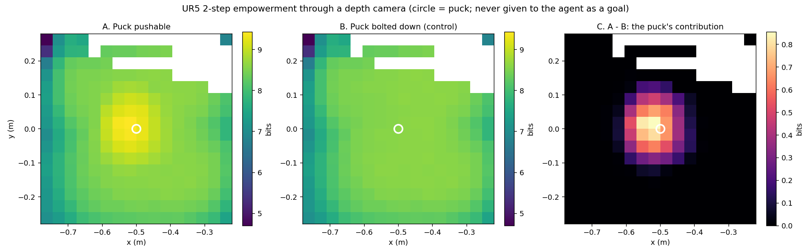
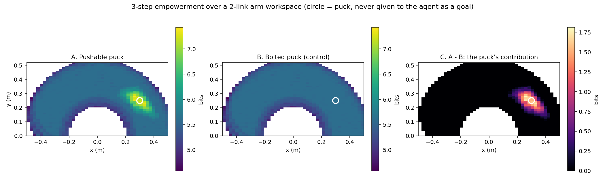

# Instinct Manipulation

**Empowerment-driven intrinsic motivation for a UR5, in ROS 2 + Gazebo.**
*Keywords: empowerment, intrinsic motivation, UR5, depth camera, manipulation, ROS 2, Gazebo, information theory, reward-free.*

An implementation of n-step empowerment — Salge, Glackin & Polani, *Empowerment: An Introduction* (arXiv:1310.1863) — running on a UR5 with an oblique depth camera.

**The claim being tested:** a robot arm can identify which object in its workspace is worth engaging with, without being told the object exists, what it is, or what to do with it.

## Result — UR5 through a depth camera



Two-step empowerment over a table plane, scored on what a **depth camera sees** rather than on ground-truth object pose. The circle marks the puck; the agent is never given its position as a goal.

- **A** — puck pushable. A clear peak forms at the puck.
- **B** — puck bolted down. Control condition: present and visible, but immovable.
- **C** — A minus B. The puck's own contribution: **+0.85 bits**, falling to zero within ~10 cm.

Measured with exhaustive enumeration (all 6561 sequences at horizon 2), the contrast is sharper still: **+2.22 bits at contact, +0.007 just 10 cm away.**

### Why the outcome is a depth image, not a pose

Empowerment is defined as the channel from an agent's actuators to its **own sensors** (paper §4.3). Scoring against ground-truth object pose quietly skips the sensor half and measures something easier. Here the outcome vector is a rendered depth image, so anything the camera cannot resolve does not count — which is the point.

That has teeth. Below a certain camera resolution the puck's contribution collapses toward zero, because one pixel's footprint at the table exceeds the puck's diameter. The paper's "box is not perceivable" condition arrives from optics rather than being imposed by hand.

### The 2-link version



The same experiment on a 2-link planar arm with ground-truth outcomes, kept because it runs in seconds and is the right place to build intuition before touching Gazebo.

## Layout

```
intrinsic_core/                    C++17 + Eigen, no ROS dependency
  src/empowerment.cpp              estimator + Blahut-Arimoto
  src/discretise.cpp               when two continuous outcomes are "the same"
  src/ur5.cpp                      UR5 DH kinematics, damped-least-squares IK
  src/sensors.cpp                  analytic depth camera (ray-cast)
  src/perception.cpp               finds objects in a depth image, no oracle
  src/grasp.cpp                    grasp as a state transition, not a script
  src/ur5_grasp.cpp                UR5 + object + held flag; transfer empowerment
  src/batched.cpp                  the UR5 + camera estimator, one place
  src/arm2d.cpp                    2-link planar arm (intuition / fast iteration)
  tools/run_ur5_map.cpp            the UR5 map, as CSV
  tools/run_arm_map.cpp            the planar map, as CSV
  tools/sweep_parameters.cpp       finds the usable parameter band
  test/                            49 gtest cases, all passing

intrinsic_motivation_ros/          ROS 2 (ament_cmake, rclcpp)
  src/empowerment_node.cpp         live empowerment from /joint_states + depth
  src/drifter_driver.cpp           drives the non-contingent object
  src/greedy_climber.cpp           drives the UR5 up the gradient
  src/grasp_climber.cpp            drives it by TRANSFER empowerment, and grasps
  src/object_source.cpp            depth image -> tracked objects, for the agent
  src/detector_eval.cpp            scores the detector against ground truth
  src/empowerment_node_planar.cpp  2-link versions, kept for the simple demo
  src/greedy_climber_planar.cpp
  worlds/empowerment_table.sdf     Gazebo world: two tables, puck, depth cam
  urdf/ur5_gz.urdf.xacro           UR5 for gz-sim, no ros2_control
  urdf/robotiq_2f85.xacro          2F-85 gripper, primitives only, no meshes
  config/gz_bridge.yaml            gz <-> ROS topic bridge
  config/empowerment.yaml          UR5 parameters, with measured guidance
  config/empowerment_planar.yaml   2-link parameters
  config/initial_positions.yaml    spawn pose, shared by sim and agent
  launch/gazebo_ur5.launch.py      full stack
  launch/empowerment.launch.py     planar, no Gazebo
  rviz/empowerment.rviz
```

## Running it

### Standalone (no ROS, no Gazebo)

`intrinsic_core` is a plain ament_cmake library and depends on nothing but
Eigen, so it builds and tests without a simulator:

```bash
colcon build --packages-select intrinsic_core
colcon test --packages-select intrinsic_core && colcon test-result --all
#   49 tests, 0 failures

. install/setup.bash
ros2 run intrinsic_core sweep_parameters          # find the usable band first
ros2 run intrinsic_core run_ur5_map --grid 16     # writes ur5_empowerment_map.csv
```

The two figures above are rendered from those CSVs. The tools do not draw
them: there is no plotting library in the dependency list, and the numbers
were always the artefact rather than the picture.

### Full stack

ROS 2 Humble and **Gazebo Harmonic** (`gz sim`, gz-sim 8). The launch pins
`gz_version:=8`, and the SDF uses Harmonic's `gz-sim-*-system` plugin names
and `gz.msgs.*` bridge types throughout. `ros_gz` has to be built against
Harmonic too -- if the simulator starts but no ROS topics ever appear, that
is the thing to check:

```bash
ldd $(ros2 pkg prefix ros_gz_bridge)/lib/ros_gz_bridge/parameter_bridge | grep gz-transport
# gz-transport13 -> Harmonic, correct
```

```bash
sudo apt install gz-harmonic \
                 ros-$ROS_DISTRO-ros-gz \
                 ros-$ROS_DISTRO-ur-description \
                 ros-$ROS_DISTRO-xacro \
                 ros-$ROS_DISTRO-robot-state-publisher

# both packages are ament_cmake; put the repo under a colcon workspace's src/
colcon build
source install/setup.bash

# scene only
ros2 launch intrinsic_motivation_ros gazebo_ur5.launch.py

# no Gazebo GUI, e.g. over ssh
ros2 launch intrinsic_motivation_ros gazebo_ur5.launch.py gui:=false rviz:=false

# empowerment monitor
ros2 launch intrinsic_motivation_ros gazebo_ur5.launch.py empowerment:=true
ros2 topic echo /empowerment/value

# let it drive the arm -- no goal, no reward
ros2 launch intrinsic_motivation_ros gazebo_ur5.launch.py \
    empowerment:=true control:=true

# control condition: agent's model says the puck cannot move
ros2 launch intrinsic_motivation_ros gazebo_ur5.launch.py \
    empowerment:=true control:=true bolted:=0.0

# instinct + information
ros2 launch intrinsic_motivation_ros gazebo_ur5.launch.py \
    empowerment:=true control:=true task_bonus:=2.0

# approach, then let TRANSFER empowerment decide -- this one grasps
ros2 launch intrinsic_motivation_ros gazebo_ur5.launch.py grasp:=true

# ... and the objective that refuses to, for comparison
ros2 launch intrinsic_motivation_ros gazebo_ur5.launch.py \
    grasp:=true objective:=own_sensor
```

**No ros2_control.** `ur_simulation_gz` is not released for Humble, and the
Humble binaries of `gz_ros2_control` are built for the wrong Gazebo -- pull
them in and the controller plugin silently fails to load against Harmonic.
The arm is driven by gz-sim's own
`JointTrajectoryController` instead, which needs no extra packages. The ROS
interface is unchanged: `greedy_climber` still publishes
`trajectory_msgs/JointTrajectory` on
`/joint_trajectory_controller/joint_trajectory`, exactly what a real
`ur_robot_driver` exposes, and `ros_gz_bridge` carries it into the simulator.

If `spawn_ur5` reports `Request to create entity ... timed out`, Gazebo was
still loading when the spawn fired: `spawn_delay:=20`.

## Two models, and why

This confuses people, so stating it plainly:

| | what it is | speed |
|---|---|---|
| **Gazebo** | the world. Real contact physics, real depth rendering. Ground truth. | 1x real time |
| **Analytic UR5 + camera** | what the agent *imagines*. Used to predict candidate futures. | 6561 rollouts in 0.6 s |

The agent must evaluate thousands of candidate futures per control cycle. Stepping Gazebo thousands of times per decision is impossible, so the agent carries its own fast forward model and predicts with that. Gazebo remains the world it actually acts in and senses from.

This is not a shortcut. Empowerment is *defined* over a forward model, and the paper explicitly places acquiring that model outside the formalism (§4.8). Every model-based method has this structure.

## The parameters that decide everything

The paper calls empowerment parameter-free. On a continuous system that is not true, and pretending otherwise is how you get a meaningless map. Measured contrast (empowerment at the object minus empowerment away from it):

```
RESOLUTION (horizon 3)              HORIZON (resolution 0.025)
  0.001 m   +2.26  saturated          1 step   +0.17  flat
  0.010 m   +2.20  saturated          2 steps  +1.12  usable
  0.025 m   +1.93  usable             3 steps  +1.93  usable
  0.060 m   +1.56  usable             4 steps  +1.93  usable
  1.000 m   +0.00  dead               5 steps  +1.90  saturated
```

Both parameters fail on *both* sides. Too short a horizon and nothing is reachable; too long and everything is, which is §4.5.5's "tragedy of the Greek gods" — an agent that can reach anything finds nowhere interesting. Run `sweep_parameters` before trusting any result, and again after changing the arm.

## Things found along the way

**An overhead camera is occluded by the arm exactly when it matters.** Looking straight down at the puck, an arm reaching to the puck's (x, y) blocks it completely — zero pixels differ between a scene with the puck and one without. Empowerment still found it, because pushing displaces the puck *out* from under the arm where the camera can see it again, so the visible signal was the puck's **displacement** rather than the puck. Documented in `test_arm_occludes_puck_from_overhead_camera`.

That was survivable while the object's position came from ground truth. It is not survivable once the agent has to *find* the object in the image, because the detector goes blind exactly at contact. The camera is now oblique — 36 deg below horizontal, looking back along +x toward the arm, so the object sits in front of the arm rather than behind it. The second reason is lift: from directly overhead, raising the puck 0.1 m changes its depth from 0.87 to 0.77 and nothing else, so a grasp is nearly invisible. From an angle the object separates from the table and its height above the surface is measured directly.

**Sensor resolution reproduces the paper's perception condition for free.** The puck's contribution decays as pixels get coarser and eventually vanishes. Nobody imposed "the box is not perceivable"; it falls out of the optics.

The threshold is *not* one pixel per puck, though. Rendering is ray-cast rather than area-averaged, so an object smaller than a pixel still flips that pixel whenever a ray lands on it; what kills the signal is ray spacing coarse enough that no ray hits the object at all, roughly three times its diameter. Re-measured after `CameraConfig.fov_deg` was corrected to mean the *horizontal* field of view (it was being read as vertical, so the model saw 38.6 deg while claiming 30):

```
 16x12    3.2 cm pitch   +1.21 bits
  8x6     6.4 cm         +0.93
  6x4     8.5 cm         +0.87
  4x3    12.7 cm         +0.53
  2x2    25.5 cm         +0.00   nothing resolved
```

**Joint increments commute** on the planar arm: `[+1,−1,0]` and `[0,−1,+1]` end at identical angles, so 729 sequences reach only 235 distinct configurations at any resolution. Open-loop empowerment there is capped near 7.9 bits, not the naive `log2(9³) = 9.5`. Real dynamics with momentum would reduce this degeneracy.

**The control condition is not optional.** Panels A and B alone are dominated by the arm's own kinematics — empowerment is naturally low near the workspace boundary and near singularities whether or not a puck exists. Only the difference isolates the object.

**Full-resolution depth saturates everything.** A 640×480 image has 307200 dimensions; every rollout differs in some pixel, nothing ever collapses, and empowerment pins at `log2(n_sequences)` everywhere. The downsampling in `config/empowerment.yaml` *is* the sensor model, not a performance hack.

## Picking it up, and which empowerment does it

`greedy_climber` does not pick the object up, and will not. It maximises
OWN-SENSOR empowerment: the outcome is the depth image, and the arm's own
body is most of what varies in it. Measured on this model, over all 83
actions available from a pose at the object, closing the gripper ranks
**83rd of 83** — the single worst thing that agent can do. The paper states
this as a contraindication (§4.8): if the goal state is not option-rich, an
empowerment maximiser will never go there.

`grasp_climber` maximises TRANSFER empowerment: the outcome is the OBJECT's
state alone, and nothing about the arm. Same arm, same physics, same state,
and only the definition of the outcome differs. Closing then ranks **1st of
83**.

```
from a pose at the object, over all 83 actions
  own-sensor   CLOSE ranks 83/83     hovering wins by 2.66 bits
  transfer     CLOSE ranks  1/83     grasping wins by 1.05 bits
```

The mechanism, from the bolted control: own-sensor does not dislike holding,
it likes *pushing*. Shoving gives the object semi-independent motion and so
multiplies the variety in the picture, and grasping destroys that
independence by making the object a rigid function of the tool. Bolt the
object so it cannot be pushed and the penalty vanishes (−2.66 → +0.09).

So the grasp is derived from the objective rather than rewarded. There is no
task bonus in `grasp_climber`, nothing that says "holding is good", and no
goal position. `greedy_climber` still carries a `task_bonus_weight` for the
other experiment — a single scalar for "object grasped", with no information
about where the object is or how to reach it:

```bash
ros2 launch intrinsic_motivation_ros gazebo_ur5.launch.py \
    empowerment:=true control:=true task_bonus:=2.0
```

**In simulation it works, and it is not yet reliable.** In the best run the
arm approached on camera alone, transfer empowerment chose to close, the
measured jaw angle confirmed the fingers had stopped on something, and it
carried the puck for 400 s — grip point and object 16 to 43 mm apart
throughout, ending 21 cm below the table top, out past the edge. Most
attempts still miss: the pads land beside the object and the jaws close on
air. That is detected rather than assumed — an empty close reads 0.30/0.30
rad against 0.37 summed when something is between the pads — and the arm
reopens and tries again. Getting the pads onto the object reliably is the
open problem.

What empowerment cannot do here is find the object from across the table.
Its contribution is zero beyond about 20 cm, because nothing the arm can do
within the horizon touches it, so every imagined future leaves it where it
is and a movable object scores identically to a bolted one. Crossing that
gap is plain motion toward something perception already sees. Empowerment's
job is deciding what to do on arrival, which is the part it is good at.

The division of labour is the interesting part, and it is the honest framing
for this work:

> **Instinct finds what is actionable. Information picks which one.**

With one object, empowerment alone looks almost intentional. With three, it dithers — drawn to all of them, committing to none, and preferring whichever is lightest rather than whichever matters. That failure is more informative than the single-object success, and it is worth filming.

## What is tested, and what is not

Being explicit, because the two halves have very different confidence:

**Verified here** — 49 passing gtest cases. UR5 DH kinematics against known geometry, numerical IK to sub-millimetre, depth rendering, batched-vs-reference estimator agreement to 1e-9, the empowerment peak, the bolted-puck control, the occlusion effect, and the sensor-resolution threshold. Both figures are reproducible from the tools.

**Verified in simulation** — the full stack has been brought up on ROS 2 Humble + Gazebo Harmonic (gz-sim 8), headless, and measured:

- the world loads and the UR5 spawns into it;
- all six joints hold the spawn pose to within 0.005 rad with zero velocity chatter;
- a `trajectory_msgs/JointTrajectory` published on `/joint_trajectory_controller/joint_trajectory` moves the arm to the commanded angles within 0.002 rad, through `ros_gz_bridge`;
- `/joint_states` comes back with the six UR5 joint names;
- `/camera/depth/image_raw` publishes 640x480 `32FC1` — puck top reads 0.870 m against 0.950 m of bare table, from a camera 0.95 m above it, which is exactly right;
- `/puck/pose` and `/clock` arrive;
- `empowerment_node` publishes `/empowerment/value` (8.87 bits at the spawn pose, below the log2(2000) = 10.97 saturation ceiling, so the estimate has structure);
- `greedy_climber` drives the arm off the spawn pose with no goal and no reward;
- `bolted:=` and `task_bonus:=` reach the nodes as floats.

### The scene

Two tables of equal height (tops at 0.75 m) with 0.30 m between them: the UR5
on one, three objects on the other under an oblique depth camera, and a
Robotiq 2F-85 on the flange.

**The three objects are identical to the camera and differ only in how they
respond to being touched.** Same cylinder, same 0.04 m radius, same 0.08 m
height, same x, spread +-0.24 m in y. Measured live, they come back at 3839,
3833 and 3734 pixels — nothing in the depth image separates them:

| | behaviour | contingency |
|---|---|---|
| `puck` | moves when pushed | contingent |
| `fixed_block` | never moves (`<static>`) | unresponsive |
| `drifter` | slides on its own, 8 s cycle | non-contingent |

The drifter is the point of the scene. It is a **noisy TV**: something that
changes constantly but not because of anything the agent did. The two obvious
intrinsic objectives disagree sharply about it, so the scene discriminates
between them rather than merely demonstrating one.

```
                static    drifter    puck
  curiosity      low      HIGH       medium     <- captured by the distractor
  empowerment    low      low        HIGH
```

A prediction-error agent is drawn to the drifter precisely because it is
unpredictable. Empowerment should ignore it, because the mutual information
between the *agent's actions* and its state is zero — it moves, but not for
you. `drift:=false` parks it, which is the control.

Two details in that layout are load bearing, and both were found by watching
the arm misbehave rather than by reasoning about it.

**The arm is yawed 180 degrees.** `intrinsic_core`'s DH convention is half a
turn about z from `ur_description`'s URDF: at identical joint angles the
analytic model puts the tool at (-0.631, -0.109, 0.323) and Gazebo puts it at
(+0.631, +0.109, 0.323), exactly negated in x and y. Spawn the arm unrotated
and the simulator reaches away from the bench while the agent plans toward
it, so the climber drives confidently in the wrong direction and never
touches anything. The empowerment number stays plausible throughout, because
it is computed entirely inside the analytic model. Nothing catches this
except looking at the screen. With the yaw applied the two agree to 1 mm.

**The UR5 sits on a 0.25 m riser, not directly on its table.** SDF has no way
to state initial joint positions, so Gazebo always spawns the arm at all
zeros, and a UR5 at all zeros is stretched horizontally 0.817 m out with the
wrist 5 mm *below* its own base plane. Bolt it level with a bench that is
within 0.87 m and the arm materialises inside the bench, jams, and then
creeps toward its start pose over minutes while shoving the puck around.
Moving the bench beyond 0.87 m would put it outside the arm's 0.85 m reach,
so the clearance has to come from height. Putting it in the robot's mount
rather than in the tables keeps both tables level.

**Still not verified** — RViz, skipped because the test machine renders
headless. The RViz config is written but unexercised.

What first bringup actually found, listed because these are the ones that will bite again:

- **`setup.cfg` was missing.** Without it setuptools installs the node executables to `<prefix>/bin` while `launch_ros` looks in `<prefix>/lib/<package>`, and the launch dies with `libexec directory ... does not exist`, a message that points nowhere near the cause.
- **The launch file started Gazebo twice**, once directly and once inside `ur_simulation_gz` — a package that is not released for Humble at all, so the whole launch failed before either copy came up.
- **`empowerment.launch.py` ran the UR5 nodes**, not the planar ones its own docstring described, on a parameter file naming six UR5 joints. It waited on `/joint_states` forever. It now runs `*_planar` against `config/empowerment_planar.yaml`.
- **The camera FOV disagreed with the agent's model** — 60 deg in the world, 30 deg in `empowerment.yaml`. It changes nothing numerically today (see below), but it means the rendered depth and the predicted depth were not the same sensor, which is the one thing this project claims to take seriously. The world now says 30; if you change one, change the other.
- **Tuning the joint controller is not a formality.** The inertia each joint sees spans four orders of magnitude down the arm. One set of gains for all six puts the wrists at w ~ 900 rad/s against a 1 ms physics step; they limit-cycle at the joint velocity limit, and in position alone that reads as a joint quietly parking 0.1 rad from wherever you sent it, at any gain. Watch reported joint *velocities*, not just positions.

**The oracle is out of the loop, structurally.** `empowerment_node` and
`greedy_climber` used to take the puck's position from `/puck/pose`, which is
the simulator handing over the answer. It made the central claim only half
true: the outcome half was honest and the input half was not. The climber was
the worse offender -- it is the node that actually *moves the arm*, and it
never looked at the camera at all.

Both now locate objects themselves, through `intrinsic_core/perception.cpp`
(shared via `object_source.cpp`), by fitting the dominant plane in the depth
image and segmenting whatever stands off it. The prior is deliberately weak
and generic -- *the big flat thing is the support surface, and anything
standing proud of it is a thing* -- the sort of innate structure a
core-knowledge account would grant an infant, not a learned detector.

Neither node subscribes to any topic carrying a true object position any
more. Not behind a parameter, not disabled: the subscription does not exist,
so the agent cannot consult ground truth even by accident. Scoring the
detector is done by a **separate process**, `detector_eval`, which is the only
place the estimate and the truth are allowed to meet:

```bash
ros2 launch intrinsic_motivation_ros gazebo_ur5.launch.py \
    empowerment:=true eval:=true
ros2 topic echo /detector/error/puck
```

Measured live against Gazebo ground truth, over 110 samples:

```
puck          5.9 mm mean,   6.3 mm max     stationary
fixed_block   6.1 mm mean,   6.7 mm max     stationary
drifter      79.5 mm mean, 191.2 mm max     moving
```

Read those per object rather than averaging them, because the last row
measures something different. For the stationary objects the number is the
detector's accuracy. For the drifter it is dominated by **staleness**: the
agent's estimate refreshes only when its loop runs, and that loop is
irregular and well below its configured 1 Hz. A large drifter error says the
loop is slow, not that perception is inaccurate. See *the loop does not keep
time* below.

> perception says **there is something there**.
> empowerment says **whether it is worth touching**.


## Timing, and a diagnosis that was wrong twice

Worth recording in full, because the wrong answers were more plausible than
the right one and the same trap is set for anyone who repeats this.

**The symptom.** The object count occasionally read 4 instead of 3. That is
not cosmetic: losing a track identity resets `independent_motion_std`, which
is the statistic that identifies the drifter as non-contingent in the first
place, so the measurement the scene exists to make was being reset on the one
object it needs to characterise.

**Wrong answer 1: the loop is starved.** Measuring when messages *arrived* at
a separate probe process suggested the loop ran at a median 0.54 Hz with gaps
up to 24 s, and a single-threaded executor with a 1.2 MB depth
subscription is a very plausible culprit. It was wrong. Instrumenting the
tick itself gives, on an idle machine:

```
tick | gap 1.00s  perceive 0.178s  estimate 0.149s  work 0.327s  raw 3 tracks 3
```

The loop keeps time exactly, and does 0.33 s of work in a 1 s budget. The
bursts were an artifact of the observer, not a property of the observed. If
you want to know how often a loop runs, time the loop; do not time when its
messages turn up somewhere else.

**Wrong answer 2: perception is dropping an object.** Also no. Logging raw
detections alongside track count shows `raw 3` on every single tick, without
exception. The detector never loses anything. And the depth callbacks that
were supposed to be starving the executor cost **10 ms in total across 395
of them**.

**The actual cause.** Under CPU contention the tick stretches, and at a 3.7 s
tick the drifter travelled 0.110 m between updates against an association
gate capped at 0.11 m. It missed by a millimetre, so the detection failed to
match its own track and started a second one. The cap cannot simply be
raised: the objects are 0.24 m apart and a gate past half that spacing starts
matching a track to its *neighbour*, which is a considerably worse failure.

**A fix that did not work,** recorded so nobody tries it again. Giving each
track a constant-velocity motion model and matching against the predicted
position is the textbook answer, and here it is useless: sampling a 30 s sine
every 3.7 s puts you close enough to Nyquist that a linear extrapolation over
one interval is badly wrong, and at larger gaps it is worse than no
prediction at all. Measured, splits per configuration:

```
   dt    travel/tick    no prediction    with prediction
  1.0 s      0.031 m              ok                 ok
  2.0 s      0.062 m              ok                 ok
  3.7 s      0.115 m           SPLIT              SPLIT
  5.0 s      0.155 m           SPLIT              SPLIT
```

**What is established, and what is not.** Being explicit, because two
confident diagnoses have already been wrong here.

Established by measurement:

```
work per tick        0.33 - 0.43 s      of a 1.0 s budget
tick gap             1.00 s on some runs, 3.4 - 4.4 s on others
raw detections       3, on every tick, without exception
depth callbacks      10 ms total across 395 of them
machine load         1.88 on 16 cores; not saturated
/clock rate          105 Hz
```

So it is not the workload, not the depth images, and not the machine. When
the gap stretches, sim time and wall time stretch together (dt tracks gap),
so the simulator is keeping real time while the 1 s timer waits four times
too long.

The remaining suspect is a single-threaded executor under roughly
140 messages a second of inbound traffic, which is a known weak point, but
that is a suspicion and not a measurement.

One clue points somewhere broader. On slow ticks the drifter moves **further
than it physically can**: at a 30 s period its peak speed is 0.021 m/s, so
0.078 m in 3.7 s, and the logs show 0.157 m. Its driver computes setpoints
from the clock and publishes at 20 Hz, so setpoints being delayed too would
make the block jump between distant targets. That suggests whatever is
happening is system-wide rather than specific to the empowerment node, and it
would be the first thread to pull.

**Consequence, and why it is not cosmetic.** A stretched tick lets the
drifter cross the association gate, so it is taken for a new object and the
count reads 4. Losing a track identity resets `independent_motion_std`, the
statistic that identifies the drifter as non-contingent. Nothing else in the
system is affected: the empowerment value, the detector's accuracy on the
static objects, and the object positions are all unharmed.

**Mitigation so far.** The drifter's period went 20 s to 30 s, purely for
margin; it only has to move, not move quickly. At 1 Hz that is 0.021 m
against a 0.11 m gate, 5.2x of headroom. The tracker's gate widens with
measured elapsed time, capped strictly below half the object spacing. Neither
addresses the cause.

## Next steps

1. **Three objects.** Cheapest change, most informative result. With one object empowerment looks almost intentional; with three it dithers, drawn to all of them and committing to none, and prefers whichever is lightest rather than whichever matters. That failure demonstrates the selection gap better than any success.
2. **Oblique camera.** Removes the occlusion described above and should sharpen the contrast.
3. **Sparse-reward comparison.** SAC with a sparse lift reward learns nothing (flat line at zero). Same reward plus empowerment should learn. Flat line vs curve is the argument a robotics audience will care about.
4. **Learned forward model.** Replace the analytic model with one trained from Gazebo rollouts. Removes the hand-specified dynamics, at the cost of model error.
5. **Real UR5.** The nodes already speak `/joint_states` and `sensor_msgs/Image`, so a real arm and a RealSense are a launch-file change. Check `depth_resolution` against the sensor's true noise floor first — setting it below that means counting noise as influence.

## Reading

- Salge, Glackin & Polani (2013), *Empowerment: An Introduction*, arXiv:1310.1863 — §4.5.4 is the box experiment reproduced here
- Klyubin, Polani & Nehaniv (2005) — the original formulation
- Mohamed & Rezende (2015) — the variational bound that made this scale
- `github.com/Mchristos/empowerment` — grid-world reference implementation

## License

MIT.
